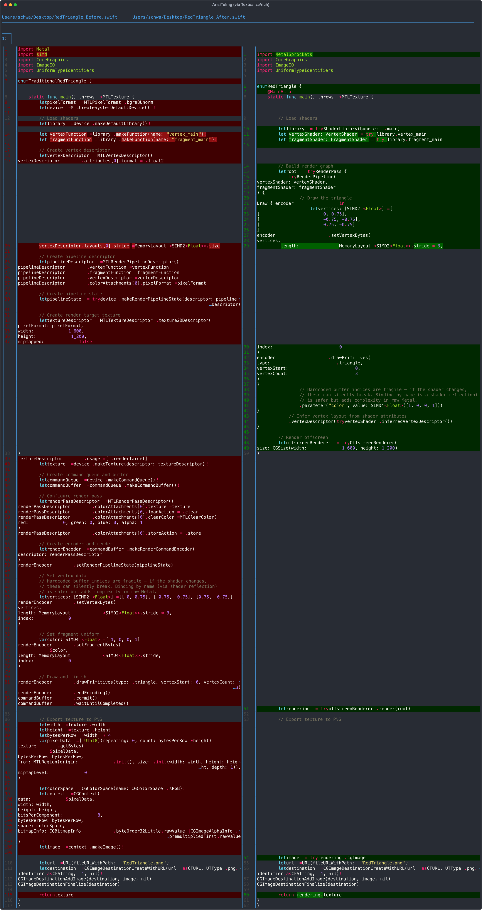

# MetalSprockets vs Raw Metal Comparison

A side-by-side comparison of rendering a red triangle using traditional Metal vs MetalSprockets.

## Files

- `RedTriangle.metal` — Shared shader source (used by both versions)
- `RedTriangle_Before.swift` — Traditional Metal (~100 lines)
- `RedTriangle_After.swift` — MetalSprockets (~55 lines)
- `RedTriangle_diff.png` — Side-by-side diff
- `RedTriangle_diff_thumb.png` — Thumbnail for use in project README

## Regenerating the diff

Requires `delta`, `ansitoimg`, and `rsvg-convert`:

```fish
# Generate side-by-side diff as PNG
delta --side-by-side --paging=never --width=180 RedTriangle_Before.swift RedTriangle_After.swift \
    | uvx --from ansitoimg ansitoimg --plugin svg --width 180 RedTriangle_diff.svg
rsvg-convert RedTriangle_diff.svg -o RedTriangle_diff.png
rm RedTriangle_diff.svg

# Generate thumbnail
magick RedTriangle_diff.png -resize 600x RedTriangle_diff_thumb.png
```

## Result


