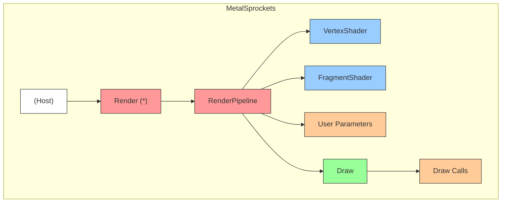

# MetalSprockets vs Vanilla Metal

## MetalSprockets Code

```swift
Render {
    RenderPipeline(vertexShader: vertexShader, fragmentShader: fragmentShader) {
        Draw { encoder in
            encoder.setVertexBytes(<...>)
            encoder.drawPrimitives(type: .triangle, vertexStart: 0, vertexCount: 3)
        }
        .parameter("color", SIMD4<Float>([1, 0, 0, 1]))
    }
}
```

## Component Mapping



## Equivalent Vanilla Metal

| MetalSprockets | Vanilla Metal |
|----------------|---------------|
| **(Host)** | `let commandQueue = device.makeCommandQueue()!`<br>`let commandBuffer = commandQueue.makeCommandBuffer()!` |
| **Render** | `let renderPassDescriptor = MTLRenderPassDescriptor()`<br>`renderPassDescriptor.colorAttachments[0].texture = texture`<br>`renderPassDescriptor.colorAttachments[0].loadAction = .clear`<br>`renderPassDescriptor.colorAttachments[0].clearColor = MTLClearColor(...)`<br>`renderPassDescriptor.colorAttachments[0].storeAction = .store`<br>`let renderEncoder = commandBuffer.makeRenderCommandEncoder(...)!` |
| **RenderPipeline** | `let pipelineDescriptor = MTLRenderPipelineDescriptor()`<br>`pipelineDescriptor.vertexFunction = vertexFunction`<br>`pipelineDescriptor.fragmentFunction = fragmentFunction`<br>`pipelineDescriptor.vertexDescriptor = vertexDescriptor`<br>`pipelineDescriptor.colorAttachments[0].pixelFormat = pixelFormat`<br>`let (pipelineState, reflection) = try device.makeRenderPipelineState(...)` |
| **VertexShader / FragmentShader** | `let library = try device.makeLibrary(source: source, options: nil)`<br>`let vertexFunction = library.makeFunction(name: "vertex_main")!`<br>`let fragmentFunction = library.makeFunction(name: "fragment_main")!` |
| **User Parameters** | `let colorIndex = reflection!.fragmentBindings.first { $0.name == "color" }!.index`<br>`renderEncoder.setFragmentBytes(&color, length: ..., index: colorIndex)` |
| **Draw Calls** | *Same as vanilla Metal* |

---

> **Summary:** MetalSprockets dramatically simplifies Metal setup and boilerplate while retaining flexibility. The real benefit is the ease of composing complex render graphs from simpler components—similar to how SwiftUI enables composable user interfaces.
