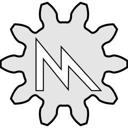
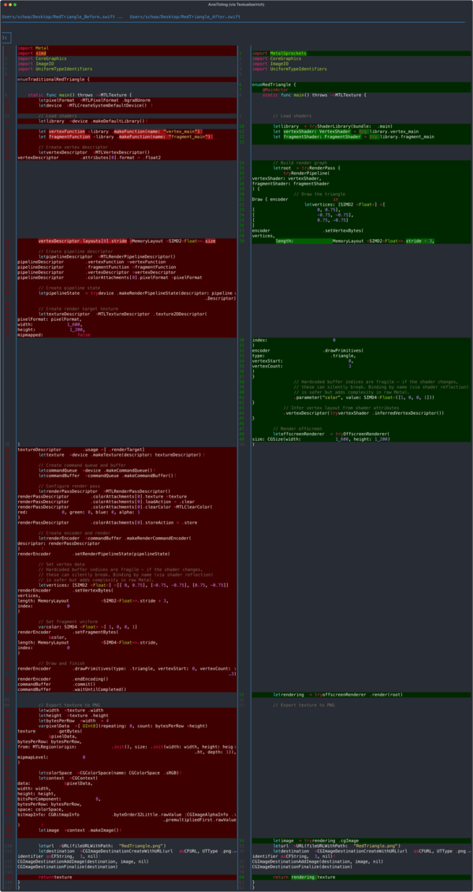

#  [MetalSprockets](https://github.com/schwa/MetalSprockets)

> "It's like SwiftUI — but for Metal."

A declarative, composable layer for Metal in Swift.

## [Documentation](https://schwa.github.io/MetalSprockets)

- [Getting Started](https://schwa.github.io/MetalSprockets/documentation/metalsprockets/gettingstarted)
- [Tutorials](https://schwa.github.io/MetalSprockets/documentation/metalsprockets/tutorialoverview)
- [Architecture](https://schwa.github.io/MetalSprockets/documentation/metalsprockets/architecture)
- [FAQ](https://schwa.github.io/MetalSprockets/documentation/metalsprockets/faq)

---

## Why MetalSprockets?

Metal is powerful but setting up even a simple render pass means writing a lot of descriptor/pipeline/encoder boilerplate. Mixing render and compute passes makes it worse.

MetalSprockets steals some of SwiftUI's ideas (result builders, composable trees, property wrappers) and applies them to Metal. You build GPU workloads as a tree of `Element`s, bind shader parameters by name instead of buffer indices, and mix render, compute, mesh, and object shaders in the same graph. It works in SwiftUI (`RenderView`), ARKit, visionOS immersive spaces, or offscreen.

---

## Requirements

- Apple Silicon Mac, iOS, or visionOS device
- Swift 6.1 / Xcode 16+
- **Apple GPUs only:** Intel Macs are not supported.

---

## Installation

Add via Swift Package Manager in your `Package.swift`

```swift
let package = Package(
    dependencies: [
        .package(url: "https://github.com/schwa/MetalSprockets", from: "0.1.0")
    ],
    targets: [
        .target(
            name: "MyApp",
            dependencies: [
                .product(name: "MetalSprockets", package: "MetalSprockets"),
                // Optional: for RenderView and visionOS support
                .product(name: "MetalSprocketsUI", package: "MetalSprockets")
            ]
        )
    ]
)
```

Or in Xcode: **File ▸ Add Packages…** and paste the repo URL.

---

## Companion repositories

- [MetalSprocketsTutorials](https://github.com/schwa/MetalSprocketsTutorials) — Tutorial companion code
- [MetalSprocketsExamples](https://github.com/schwa/MetalSprocketsExamples) — Larger examples
- [MetalSprocketsAddOns](https://github.com/schwa/MetalSprocketsAddOns) — Extra Elements and utilities
- [MetalSprocketsGaussianSplats](https://github.com/schwa/MetalSprocketsGaussianSplats) — Gaussian splatting renderer

---

## Core concepts

`Element` is MetalSprockets' `View`. Conform to it, give it a `var body: some Element`, compose them into trees. Unlike `View.body`, `Element.body` throws by default, so you wrap it in `get throws { }`. If your body doesn't throw, skip the `get throws` and return directly.

```swift
struct MyRenderPass: Element {
    var body: some Element {
        get throws {
            try RenderPass {
                try MyPipeline()
            }
        }
    }
}
```

`body` uses `@ElementBuilder` (a result builder), so `if`/`else`, `for`/`in`, and optional chaining work directly. `ForEach`, `Group`, and many other combinators work like their SwiftUI counterparts.

The built-in elements map to Metal's structure:

| Element | Metal equivalent |
|---------|------------------|
| `RenderPass` | Render command encoder |
| `RenderPipeline` | Render pipeline state |
| `ComputePass` | Compute command encoder |
| `ComputePipeline` | Compute pipeline state |
| `Draw` | Draw calls on the encoder |

State management mirrors SwiftUI's property wrappers, prefixed with `MS` to avoid collisions:

| MetalSprockets | SwiftUI equivalent |
|----------------|--------------------|
| `@MSState` | `@State` |
| `@MSBinding` | `@Binding` |
| `@MSEnvironment` | `@Environment` |

---

## Example

A SwiftUI view that runs a compute pass to update particles, then renders a skybox and the particles in a single render pass:

```swift
import SwiftUI
import MetalSprockets
import MetalSprocketsUI

struct ContentView: View {
    let library = try! ShaderLibrary(bundle: .main)
    let particleBuffer: MTLBuffer = // ...
    let skyboxMesh: MTKMesh = // ...
    let particleCount = 10_000

    var body: some View {
        RenderView { context, drawableSize in
            let viewProjectionMatrix = // ...

            // Compute pass: update particles on the GPU
            try ComputePass {
                try ComputePipeline(kernel: library.updateParticles) {
                    Dispatch.threads(particleCount, threadsPerThreadgroup: 256)
                }
                .parameter("deltaTime", value: context.frameUniforms.deltaTime)
                .parameter("particles", buffer: particleBuffer)
            }

            // Render pass: draw the scene
            try RenderPass {
                // Skybox
                try RenderPipeline(
                    vertexShader: library.skyboxVertex,
                    fragmentShader: library.skyboxFragment
                ) {
                    Draw { encoder in
                        encoder.draw(skyboxMesh)
                    }
                }
                .parameter("viewProjection", value: viewProjectionMatrix)

                // Particles
                try RenderPipeline(
                    vertexShader: library.particleVertex,
                    fragmentShader: library.particleFragment
                ) {
                    Draw { encoder in
                        encoder.setVertexBuffer(
                            particleBuffer, offset: 0, index: 0
                        )
                        encoder.drawPrimitives(
                            type: .point,
                            vertexStart: 0,
                            vertexCount: particleCount
                        )
                    }
                }
                .parameter("viewProjection", value: viewProjectionMatrix)
                .depthCompare(function: .less, enabled: true)
            }
        }
        .metalDepthStencilPixelFormat(.depth32Float)
    }
}
```

See the [Tutorials](https://schwa.github.io/MetalSprockets/documentation/metalsprockets/tutorialoverview) for step-by-step guides.

---

## Comparison

A red triangle rendered both ways. Traditional Metal on the left, MetalSprockets on the right. 

[](Documentation/Comparison/RedTriangle_diff.png)


---

## Environment Variables

Set these in Xcode's scheme editor or your shell. Truthy values: `yes`, `true`, `1`, `on` (case-insensitive).

| Variable | Description |
|----------|-------------|
| `MS_LOGGING` | Enable general logging output (alias: `LOGGING`) |
| `MS_VERBOSE` | Enable verbose logging (alias: `VERBOSE`) |
| `MS_METAL_LOGGING` | Enable logging within Metal shaders (requires Metal logging support at shader compile time) |
| `MS_FATALERROR_ON_THROW` | Convert thrown errors to fatal errors for easier debugging |
| `MS_RENDERVIEW_LOG_FRAME` | Log frame rendering information in RenderView |
| `MS_DUMP_SNAPSHOTS` | Dump system snapshots to JSONL files in `$TMPDIR/metal-sprockets_snapshots/` for debugging the element tree |


---

## License

MIT — see [LICENSE](LICENSE)

---

## Links

- [Swift Package Index](https://swiftpackageindex.com/schwa/MetalSprockets)
- [MetalCompilerPlugin](https://github.com/schwa/MetalCompilerPlugin)
