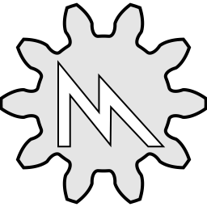
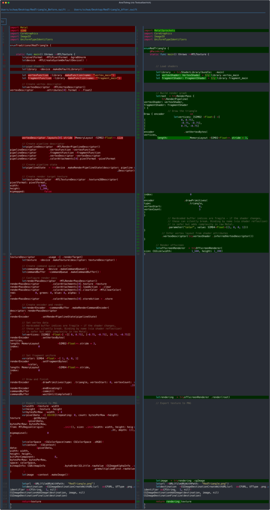

#  [MetalSprockets](https://github.com/schwa/MetalSprockets)

> "It's like SwiftUI — but for Metal."

A declarative, composable layer for Metal in Swift.

## [Documentation](https://docs.metalsprockets.com)

- [Getting Started](https://docs.metalsprockets.com/documentation/metalsprockets/gettingstarted)
- [Tutorials](https://docs.metalsprockets.com/documentation/metalsprockets/tutorialoverview)
- [Architecture](https://docs.metalsprockets.com/documentation/metalsprockets/architecture)
- [FAQ](https://docs.metalsprockets.com/documentation/metalsprockets/faq)

---

## Why MetalSprockets?

Even a simple Metal render pass needs descriptors, pipeline state, and encoder setup. Mixed render and compute passes need more setup.

MetalSprockets applies SwiftUI's result builders, composable trees, and property wrappers to Metal. You build GPU workloads as a tree of `Element`s. Shader parameters bind by name instead of buffer index. One graph can combine render, compute, mesh, and object shaders.

MetalSprockets supports SwiftUI (`RenderView`), ARKit, visionOS immersive spaces, and offscreen rendering.

---

## Requirements

- macOS 26, iOS 26, or visionOS 26 or later
- Swift 6.2+ and Xcode 26.6+ (CI uses Xcode 26.6; developed with Xcode 27)
- **Apple GPUs only:** Intel Macs are not supported.

---

## Installation

Add the dependency to your `Package.swift`:

```swift
let package = Package(
    dependencies: [
        .package(url: "https://github.com/schwa/MetalSprockets", from: "0.1.0")
    ],
    targets: [
        .target(
            name: "MyApp",
            dependencies: [
                .product(name: "MetalSprockets", package: "MetalSprockets"),
                // Optional: for RenderView and visionOS support
                .product(name: "MetalSprocketsUI", package: "MetalSprockets")
            ]
        )
    ]
)
```

Alternatively, select **File ▸ Add Packages…** in Xcode. Then paste the repository URL.

---

## Companion repositories

- [MetalSprocketsTutorials](https://github.com/schwa/MetalSprocketsTutorials) — Tutorial companion code
- [MetalSprocketsExamples](https://github.com/schwa/MetalSprocketsExamples) — Larger examples
- [MetalSprocketsAddOns](https://github.com/schwa/MetalSprocketsAddOns) — Extra Elements and utilities
- [MetalSprocketsGaussianSplats](https://github.com/schwa/MetalSprocketsGaussianSplats) — Gaussian splatting renderer

---

## Core concepts

`Element` is the MetalSprockets equivalent of `View`. Each element declares a `var body: some Element` and composes other elements into a tree.

Unlike `View.body`, `Element.body` supports throwing getters. For a throwing body, use `get throws { }`. If the body does not throw, return directly.

```swift
struct MyRenderPass: Element {
    var body: some Element {
        get throws {
            try RenderPass {
                try MyPipeline()
            }
        }
    }
}
```

`body` uses the `@ElementBuilder` result builder. It supports `if`/`else` and optional chaining. `ForEach`, `Group`, and many other combinators work like their SwiftUI counterparts.

The built-in elements map to Metal's structure:

| Element | Metal equivalent |
|---------|------------------|
| `RenderPass` | Render command encoder |
| `RenderPipeline` | Render pipeline state |
| `ComputePass` | Compute command encoder |
| `ComputePipeline` | Compute pipeline state |
| `Draw` | Draw calls on the encoder |

State management mirrors SwiftUI's property wrappers, prefixed with `MS` to avoid collisions:

| MetalSprockets | SwiftUI equivalent |
|----------------|--------------------|
| `@MSState` | `@State` |
| `@MSBinding` | `@Binding` |
| `@MSEnvironment` | `@Environment` |

---

## Example

A SwiftUI view that runs a compute pass to update particles, then renders a skybox and the particles in a single render pass:

```swift
import SwiftUI
import MetalSprockets
import MetalSprocketsUI

struct ContentView: View {
    let library = try! ShaderLibrary(bundle: .main)
    let particleBuffer: MTLBuffer = // ...
    let skyboxMesh: MTKMesh = // ...
    let particleCount = 10_000

    var body: some View {
        RenderView { context, drawableSize in
            let viewProjectionMatrix = // ...

            // Compute pass: update particles on the GPU
            try ComputePass {
                try ComputePipeline(kernel: library.updateParticles) {
                    Dispatch.threads(particleCount, threadsPerThreadgroup: 256)
                }
                .parameter("deltaTime", value: context.frameUniforms.deltaTime)
                .parameter("particles", buffer: particleBuffer)
            }

            // Render pass: draw the scene
            try RenderPass {
                // Skybox
                try RenderPipeline(
                    vertexShader: library.skyboxVertex,
                    fragmentShader: library.skyboxFragment
                ) {
                    Draw { encoder in
                        encoder.draw(skyboxMesh)
                    }
                }
                .parameter("viewProjection", value: viewProjectionMatrix)

                // Particles
                try RenderPipeline(
                    vertexShader: library.particleVertex,
                    fragmentShader: library.particleFragment
                ) {
                    Draw { encoder in
                        encoder.drawPrimitives(
                            primitiveType: .point,
                            vertexStart: 0,
                            vertexCount: particleCount
                        )
                    }
                    .vertexBuffer(particleBuffer, index: 0)
                }
                .parameter("viewProjection", value: viewProjectionMatrix)
                .depthCompare(function: .less, enabled: true)
            }
        }
        .metalDepthStencilPixelFormat(.depth32Float)
    }
}
```

See the [Tutorials](https://docs.metalsprockets.com/documentation/metalsprockets/tutorialoverview) for step-by-step guides.

---

## Comparison

Both examples render a red triangle. Traditional Metal is on the left. MetalSprockets is on the right.

[](Documentation/Comparison/RedTriangle_diff.png)


---

## Environment Variables

Set these variables in Xcode's scheme editor or your shell. The values `yes`, `true`, `1`, and `on` enable them. Values are case-insensitive.

| Variable | Description |
|----------|-------------|
| `MS_LOGGING` | Enable general logging output (alias: `LOGGING`) |
| `MS_VERBOSE` | Enable verbose logging (alias: `VERBOSE`) |
| `MS_METAL_LOGGING` | Enable logging within Metal shaders (requires Metal logging support at shader compile time) |
| `MS_FATALERROR_ON_THROW` | Convert thrown errors to fatal errors for easier debugging |
| `MS_RENDERVIEW_LOG_FRAME` | Log frame rendering information in RenderView |
| `MS_DUMP_SNAPSHOTS` | Dump system snapshots to JSONL files in `$TMPDIR/metal-sprockets_snapshots/` for debugging the element tree |


---

## License

MIT — see [LICENSE](LICENSE)

---

## Links

- [Swift Package Index](https://swiftpackageindex.com/schwa/MetalSprockets)
- [MetalCompilerPlugin](https://github.com/schwa/MetalCompilerPlugin)
